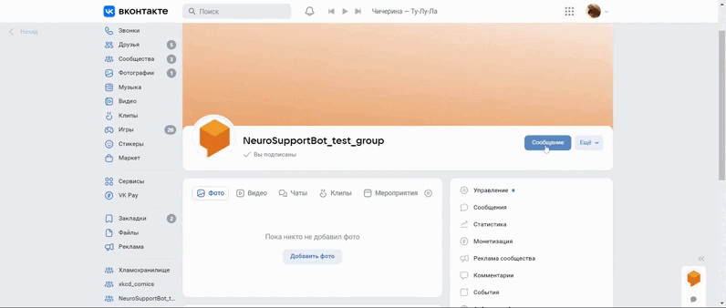

# Neuro Support Bot

Боты Телеграм и ВКонтакте, отвечающие на стандартные сообщения пользователей. Реализовано с помощью DialogFlow.



### Как установить

Python3 должен быть уже установлен. 
Затем используйте `pip` (или `pip3`, есть конфликт с Python2) для установки зависимостей:
```
pip install -r requirements.txt
```

### Подготовка [DialogFlow](https://dialogflow.cloud.google.com/)

1. [Создать проект](https://cloud.google.com/dialogflow/es/docs/quick/setup) в DialogFlow.
2. [Создать агента](https://cloud.google.com/dialogflow/es/docs/quick/build-agent).
3. Создать свои [намерения](https://dialogflow.cloud.google.com/#/agent/newagent-qseq/intents) и/или обновить существующие.
4. [Включить API](https://cloud.google.com/dialogflow/es/docs/quick/setup#api) DialogFlow на вашем Google-аккаунте.
5. Установите и инициализируйте [Google Cloud CLI](https://cloud.google.com/dialogflow/es/docs/quick/setup#sdk). 
6. [Аутентифицируйте](https://cloud.google.com/dialogflow/es/docs/quick/setup#user) учетную запись. Во время аутентификации создастся файл `credentials.json`, сохраните путь к нему в переменную окружения `GOOGLE_APPLICATION_CREDENTIALS`.

### Переменные окружения

Для работы проекта, в корень необходимо положить файл `.env` со следующими полями:

Переменные, необходимые для работы Телеграм-бота:
- `TG_BOT_TOKEN` - токен Вашего Телеграм-бота. [Как создать бота и получить токен](https://core.telegram.org/bots#how-do-i-create-a-bot).
- `VK_BOT_TOKEN` - токен Вашего бота группы во ВКонтакте. Получить можно в разделе `Работа с API`.
- `DIALOGFLOW_PROJECT_ID` - id Вашего проекта, указан в поле `GOOGLE PROJECT` Вашего агента. [Посмотреть список агентов](https://dialogflow.cloud.google.com/#/agents).
- `GOOGLE_APPLICATION_CREDENTIALS` - путь к файлу `credentials.json`, созданному во время аутентификации (см. пункт 6 в разделе `Подготовка DialogFlow`).
- `ADMIN_TG_BOT_TOKEN` - токен Телеграм-бота админа (не обязательная переменная). 
- `ADMIN_TG_CHAT_ID` - ID чата телеграмм между админом и ботом, получить можно у [userinfobot](https://telegram.me/userinfobot) (не обязательная переменная). 

### Запуск

1. Запустите Вашего Телеграм-бота командой
```bash
$ python3 tg_bot.py
```

2. Запустите Вашего бота во ВКонтакте командой
```bash
$ python3 vk_bot.py
```

Ботов можно запускать независимо друг от друга.

3. Также можно сделать отдельный Телеграм-бот для админа, куда будет приходить информация о неполадках в работе с кодом. Для этого нужно добавить переменные окружения `ADMIN_TG_BOT_TOKEN` и `ADMIN_TG_CHAT_ID`.

4. Можно добавить намерения с помощью json-файла. Создайте json-файл формата:
```
{
    "имя_Вашего_намерения": {
        "questions": [
            "Ваша_фраза_1",
             ... ,
            "Ваша_фраза_N"
        ],
        "answer": [
            "ответ_бота_1",
             ... ,
            "ответ_бота_M",
        ]
    },
    {...},
     ... ,
    {...}
}
```
Запустите команду
```bash
$ python3 add_intent.py -url ссылка_на_json_файл
```
если желаете указать файл по ссылке или
```bash
$ python3 add_intent.py -path локальный_путь_к_json_файлу
```
если файл расположен на том же утройстве, что и код.

### Цель проекта

Код написан в образовательных целях на онлайн-курсе для [dvmn.org](https://dvmn.org/).
